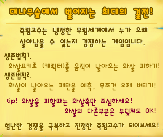
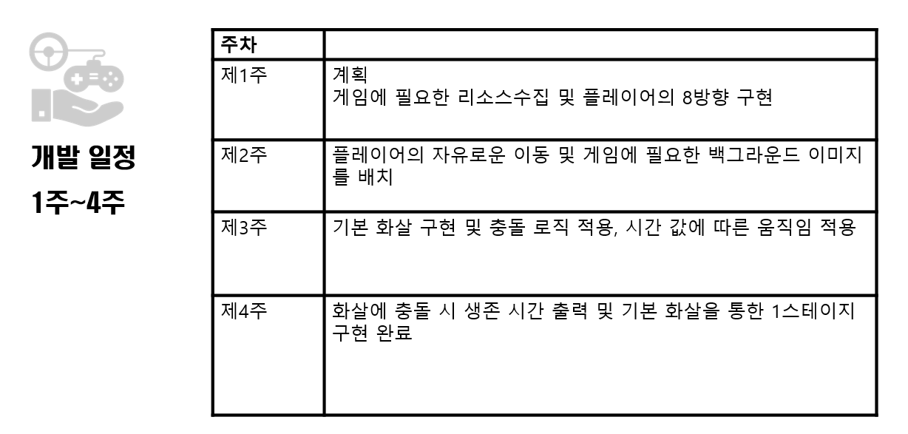
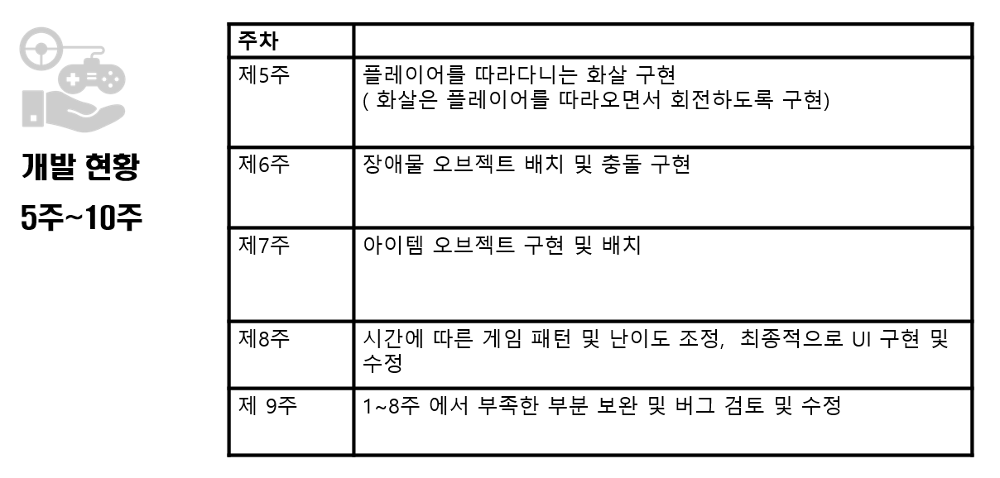

# 2015180016 박준오 _ TermProject 1차 발표

# 1. 개발 게임 - 죽림고수
## 1.1. 죽림고수 게임이란?


## 1.2. 게임 핵심 메커니즘

```
대나무 숲에서 끊임 없이 날아오는 화살을 피하여 오래 살아 남아라 ! 
```

****
# 2. 개발 범위
## 2.1. 캐릭터
```
기본 8방향의 움직임을 부드럽게 패드를 이용하여 구현하는 것을 목표로 둠.
```
## 2.2. 장애물
```
기본적으로 일직선으로 날아오는 화살을 최소 범위로 두고, 추가적으로 플레이어를 따라오는 화살, 이동불가능한 블럭, 및 맵에서 생성되는 레이저 등의 장애물을 추가할 예정
```
## 2.3. 아이템
```
플레이가 다소 간단해질 수 있는 게임 특성에 기인하여 게임에 어울리는 여러가지 아이템을 구현할 계획
대표적으로 시간이 멈추거나 화살이 잠시 느려지는등의 아이템 구현
```
## 2.4. 충돌
```
객체들 간의 기본적인 충돌을 구현
```

*****


## 2.5. UI
```
플레이어가 살아있는 시간을 보여주는 타이머를 기본으로 추가적으로 역대 플레이 기록을 통한 플레이어의 순위를 추가적으로 개발 예정
```


****
# 3. 개발 일정
