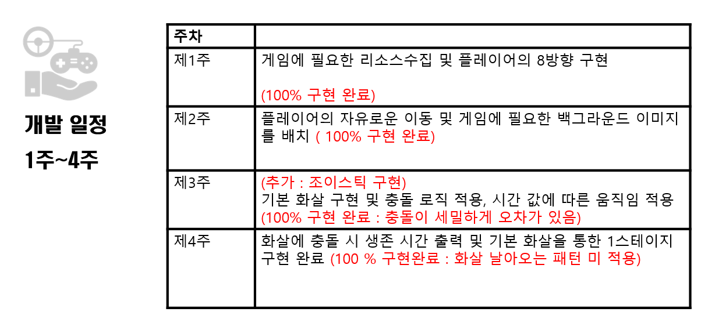

# 2015180016 박준오 _ TermProject 최종 발표

# 1. 개발 게임 - 죽림고수
## 1.1. 죽림고수 게임이란?


## 1.2. 게임 핵심 메커니즘 및 컨셉

```
액션 장르 플래시 게임
대나무 숲에서 끊임 없이 날아오는 화살을 피하여 오래 살아 남아라 ! 
```


****
# 2. 개발 진척도





# 3.  기술 , 참고 , 차용, 직접 개발, 아쉬운점

## 3.1.  사용 기술

```
Rect 충돌을 사용,  화살 촉에만 정교한 충돌을 하기위해 Offset을 주어 정밀한 충돌 가능하게 하였다.
수업시간에 배운 빌더 패턴을 이용하여 객체 생성을 유연하게 구현하였다.
```

## 3.2. 참고

```
조이스틱 클래스를 구현하기 위해서 구글을 통하여 참고하고 프로젝트에 구현하여 게임에 맞게 변형 시켰다.
```

## 3.3. 수업시간 차용

```
Recycle 을 이용하여 오브젝트 풀링 기법을 사용하였다.
수업시간에 제공된 Sound 객체를 통하여 BGM을 재생 시켰다.
수업시간에 다루었던 AnemyGenerator의 아이디어를 빌려 Arrow와 Item Generator를 만들어 사용하였다.
수업시간에 오브젝트의 회전을 Stack구조로 구현하는 부분에서 따라오는 화살의 회전을 구현하였다.
```

## 3.4. 직접 개발

```
Vector2D 클래스를 직접 개발하여 2차원상의 위치를 결정하고,  벡터의 덧셈으로 객체를 이동하고 벡터의 정규화로 객체들의 이동방향을 결정하고 벡터의 뺄셈을 이용하여 플레이어를 따라다니는 화살을 구현하였다.
```

## 3.5. 아쉬운 점

```
UI적으로 부족한점이 아쉽다. 역대 점수를 랭킹별로 기록하여 게임이 끝났을 때 랭킹보드를 보여주거나 게임을 중간에 멈출 수 있는 기능, 가로모드의 지원 등 게임플레이가 아니라 시스템 적으로 많이 부족 한 것 같다.
또한 개발을 하면서 단위 관련하여 모든 기기에 동일하게 적용하지 못한 부분이 많은 것 같다.
앱스토어에 만약 이 게임을 등록한다면, 그러한 부분을 수정하고 UI적으로 많은 수정이 필요할 것 같다.

```

# 

# 4.  Commit Log

